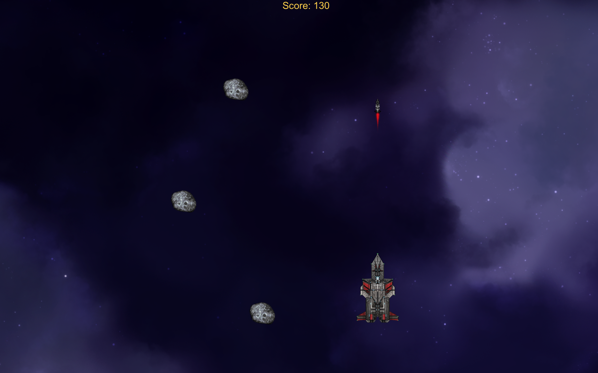

# UnityWorkshop - Hack'n Break 2019

## Nedir?
Bu Unity projesi 28-29/09/2019 tarihlerinde Hack'n Break'te katılımcılarla birlikte bilgisayarlar için hazırlanan 2D bir oyundur. 

## Nasıl bir oyun?
Oyunda bir uzay gemisini kontrol edip asteroitleri parçalayarak puan kazanıyoruz, gemi asteroitlere çarpınca da oyun bitiyor. 

## Kullanma
1. Oyunun bitmiş halini indirip Unity'de açıp inceleyebilirsiniz.
2. Oyunu sıfırdan kendiniz yapmak isterseniz. Doc klasörü altındaki **Doc_UnityWorkshop.pdf** dosyasında workshop esnasında kullandığım adımlar mevcut, o dokümandan faydalanabilirsiniz. 

## İletişim
Bana her zaman beyzahilaldurak@hotmail.com mail adresim üzerinden ulaşabilirsiniz.
